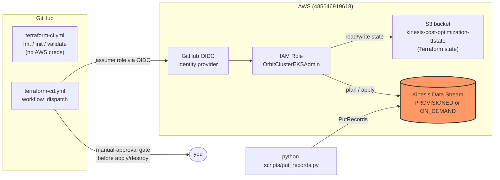
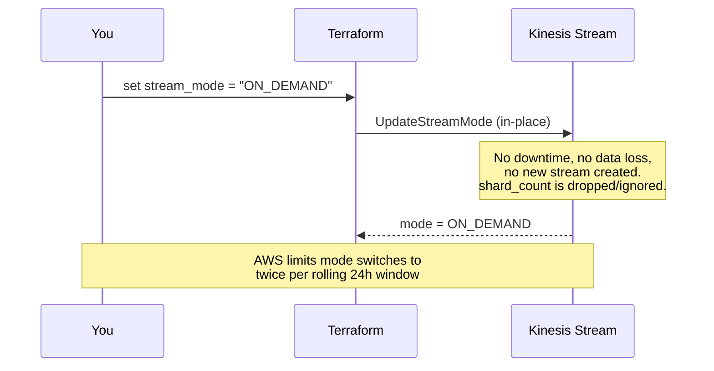

# kinesis-cost-optimization

A small, hands-on experiment: stand up an Amazon Kinesis Data Stream in
**PROVISIONED** capacity mode, push a meaningful volume of test data through
it, watch the shard-level metrics, then switch the same stream to
**ON_DEMAND** and compare — no rebuild, no data loss, just a Terraform
variable change.

## Why

Kinesis Data Streams bills very differently depending on capacity mode:

| | PROVISIONED | ON_DEMAND |
|---|---|---|
| You manage | Shard count (manual/API scaling) | Nothing — AWS auto-scales |
| Billed for | Shard-hours (fixed, regardless of usage) + PUT payload units | Stream-hours + GB ingested/retrieved (usage-based) |
| Throughput ceiling | `1,000 records/sec` and `1 MB/sec` **per shard** — hard limit, exceeding it throttles writes | Auto-scales to ~2x the highest throughput seen in the last 30 min, up to account limits |
| Best for | Steady, predictable, well-understood load | Spiky / unknown / new workloads |
| Cost risk | Over-provision → pay for idle shards. Under-provision → throttling | Sustained high & steady volume can cost more per GB than a well-sized provisioned stream |

The only way to *feel* that tradeoff is to generate real load against a real
stream and look at real metrics — which is what this repo automates.

## Architecture



**Pieces:**

- `terraform/` — root config (`providers.tf`, `variables.tf`, `main.tf`, `outputs.tf`) calling `terraform/modules/kinesis`, the reusable module that owns the single `aws_kinesis_stream` resource.
- `terraform/scripts/create-tf-backend-bucket.sh` — idempotently creates the private, versioned, encrypted S3 bucket used as the Terraform backend.
- `scripts/put_records.py` — boto3 load generator that pushes sample JSON events into the stream at a configurable rate/volume.
- `.github/workflows/terraform-ci.yml` — lint/validate on every push touching `terraform/**` (fmt check, `init -backend=false`, `validate`). No AWS credentials needed.
- `.github/workflows/terraform-cd.yml` — `workflow_dispatch` (`action: apply` or `destroy`). Assumes an AWS IAM role via GitHub OIDC, ensures the state bucket exists, plans, **waits for manual approval** (via `trstringer/manual-approval@v1`) before applying.

## Getting started

```bash
cd terraform
terraform init \
  -backend-config="bucket=kinesis-cost-optimization-tfstate" \
  -backend-config="key=kinesis-cost-optimization/terraform.tfstate" \
  -backend-config="region=us-east-1"
terraform plan
terraform apply
```

Or trigger the `Terraform CD` workflow from the Actions tab (`action: apply`) — it does the same thing, gated by an approval issue.

## Feeding test data

```bash
pip install -r scripts/requirements.txt
python scripts/put_records.py --stream kinesis-cost-optimization --count 200000 --rate 3000
```

Defaults are sized to approach a single shard's limits (1000 records/sec,
1MB/sec), so the run reports actual achieved `rec/s` and `KB/s` — that's what
tells you whether you're close to (or past) shard capacity. Key flags:

| Flag | Default | Purpose |
|---|---|---|
| `--count` | `200000` | Total records to send |
| `--rate` | `3000` | Target records/sec (aggregate) |
| `--batch-size` | `500` | Records per `PutRecords` call (AWS max is 500) |

## What we're measuring

Watch these CloudWatch metrics (Kinesis → your stream → Monitoring) while
`put_records.py` is running, before and after the mode switch:

| Metric | What it tells you |
|---|---|
| `IncomingBytes` / `IncomingRecords` | Actual throughput hitting the stream — compare against the shard limit (PROVISIONED) or just observe (ON_DEMAND, no ceiling to compare against). |
| `WriteProvisionedThroughputExceeded` | **PROVISIONED only.** Count of records rejected because a shard's 1000 rec/sec or 1MB/sec limit was exceeded. Should be 0 in ON_DEMAND. |
| `PutRecords.ThrottledRecords` (from the API response, printed by the script as `FailedRecordCount`) | Same signal, seen client-side at the moment of the call rather than after the fact in CloudWatch. |
| `GetRecords.IteratorAgeMilliseconds` | Consumer lag — only meaningful if you also add a consumer; included for completeness if you extend this experiment. |
| Per-shard `IncomingBytes`/`IncomingRecords` | Confirms whether load is spread evenly across shards (partition key distribution) or hot-shotting one shard. |

The comparison that matters: run the **same** `put_records.py` load against
the stream in PROVISIONED mode (watch for throttling as you approach
`shard_count × 1000 rec/sec`), then switch to ON_DEMAND and re-run the exact
same load — throttling should disappear (ON_DEMAND scales automatically),
at the cost of a usage-based bill instead of a flat per-shard one.

## Switching PROVISIONED → ON_DEMAND



To make the switch:

1. Edit `terraform/variables.tf` (or pass `-var='stream_mode=ON_DEMAND'`):
   ```hcl
   variable "stream_mode" {
     default = "ON_DEMAND"
   }
   ```
2. `terraform plan` / `terraform apply` (or re-run the `Terraform CD` workflow).
3. The module (`terraform/modules/kinesis/main.tf`) already handles this: `shard_count` is only ever set when `stream_mode == "PROVISIONED"`, so no manual cleanup is needed when switching.

**Things to know before you flip it:**

- It's an **in-place update**, not a replace — same stream name/ARN, same data, same consumers/producers unaffected.
- AWS **caps mode switches to twice within any rolling 24-hour period** — don't plan on flipping back and forth repeatedly in a short test loop.
- Once in ON_DEMAND, `shard_count` is meaningless (AWS manages it); the Terraform output for `shard_count` will show whatever AWS currently has provisioned internally, not something you control.
- Cost shifts from a predictable flat rate to usage-based — re-running the same `put_records.py` load lets you compare `IncomingBytes` against your AWS bill for both modes directly.
